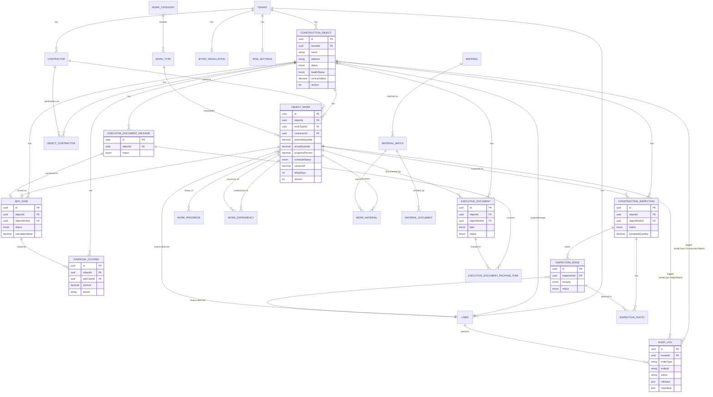

# ER-диаграмма

Отражает реальную схему `apps/backend/prisma/schema.prisma` /
`verify/schema.sql` (обе мирроpят друг друга — см.
`docs/mvp-test-scenario.md`). Не все служебные поля показаны — только
ключи и связи, важные для понимания модели.

Полные определения таблиц с индексами и уникальными ограничениями —
`apps/backend/prisma/schema.prisma` (29 моделей, 18 enum-типов — точный
подсчёт: `grep -c "^model " schema.prisma`) и два независимых, реально
выполненных способа его проверить на настоящем PostgreSQL 16 в этой среде:
1) `apps/backend/prisma/migrations/20260914120000_init/migration.sql` —
   настоящая Prisma-миграция (см. её заголовочный комментарий про
   применение через `psql` к заведомо пустой базе — 29 таблиц, 18
   enum-типов, 50 FOREIGN KEY, без единой ошибки);
2) `verify/schema.sql` — прагматичный (snake_case) SQL-эквивалент для
   independent-проверки бизнес-логики без Prisma Client (см.
   `verify/run.ts`, реально выполняется и проходит).
